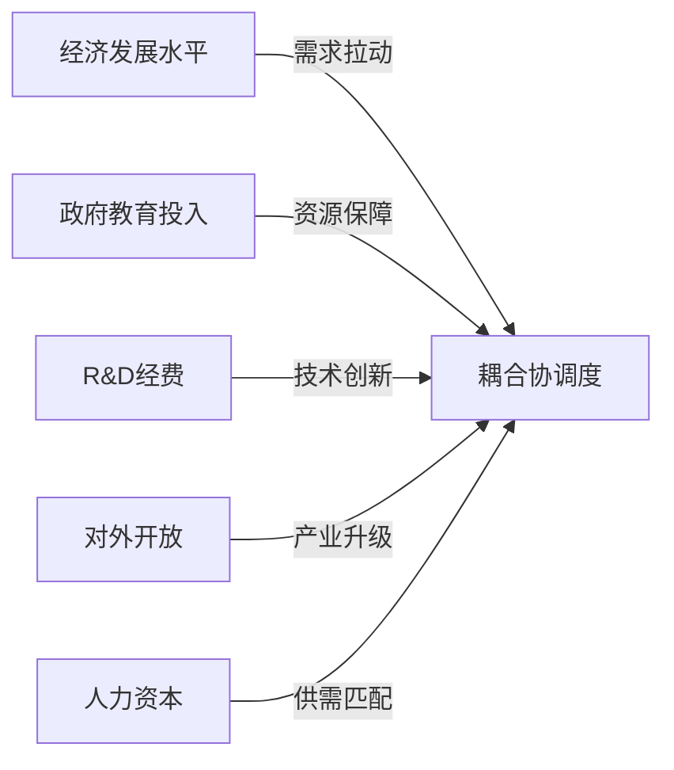

# 耦合协调发展影响因素分析

## 一、理论机制

### 1.1 影响机理



### 1.2 研究假设

| 假设编号 | 内容 | 预期方向 |
|----------|------|----------|
| H1 | 经济发展水平对耦合协调度有正向影响 | + |
| H2 | 政府教育投入对耦合协调度有正向影响 | + |
| H3 | R&D经费对耦合协调度有正向影响 | + |
| H4 | 对外开放对耦合协调度有影响 | +/- |
| H5 | 人力资本积累对耦合协调度有正向影响 | + |

## 二、变量设计

### 2.1 被解释变量

$$D_{it} = 耦合协调度$$

### 2.2 核心解释变量

| 变量 | 衡量指标 | 单位 | 数据来源 |
|------|----------|------|----------|
| pgdp | 人均GDP对数 | ln(元) | 统计年鉴 |
| edu_exp | 教育经费占GDP比重 | % | 统计年鉴 |
| rd | R&D经费占GDP比重 | % | 科技统计 |
| open | 外贸依存度 | % | 海关统计 |
| hc | 人均受教育年限 | 年 | 人口普查 |

### 2.3 控制变量

| 变量 | 衡量指标 | 预期方向 |
|------|----------|----------|
| ind_str | 产业结构 | + |
| urban | 城镇化率 | + |
| fin | 金融发展 | + |

## 三、模型设定

### 3.1 基准回归模型

$$D_{it} = \alpha + \beta_1 pgdp_{it} + \beta_2 edu\_exp_{it} + \beta_3 rd_{it} + \gamma X_{it} + \mu_i + \lambda_t + \varepsilon_{it}$$

### 3.2 面板数据模型选择

| 检验 | 目的 | 决策 |
|------|------|------|
| F检验 | 固定效应 vs 混合回归 | - |
| Hausman检验 | 固定效应 vs 随机效应 | - |

```python
import statsmodels.api as sm
from linearmodels.panel import PanelOLS

# 固定效应模型
model = PanelOLS.from_formula(
    'D ~ 1 + pgdp + edu_exp + rd + open + hc + EntityEffects + TimeEffects',
    data=panel_df
)
results = model.fit()
print(results.summary())
```

## 四、稳健性检验

### 4.1 替换被解释变量
- 替换为耦合度 C
- 替换为单一系统得分

### 4.2 替换核心解释变量
- 换用不同指标度量

### 4.3 内生性处理
- 工具变量法
- GMM估计

```python
# 两阶段最小二乘法
from linearmodels.iv import IV2SLS

model = IV2SLS.from_formula(
    'D ~ 1 + [pgdp ~ ivariable] + edu_exp + rd',
    data=panel_df
)
results = model.fit()
```

## 五、异质性分析

### 5.1 区域异质性

```python
# 分东、中、西部回归
for region in ['东部', '中部', '西部']:
    df_sub = df[df['region'] == region]
    model = PanelOLS.from_formula(...)
    results = model.fit()
```

### 5.2 时间异质性
- 金融危机前后
- 高等教育扩招前后

## 六、关联笔记

- [[05-实证分析/耦合度测算|耦合度测算]]
- [[03-研究设计/指标体系|指标体系]]
